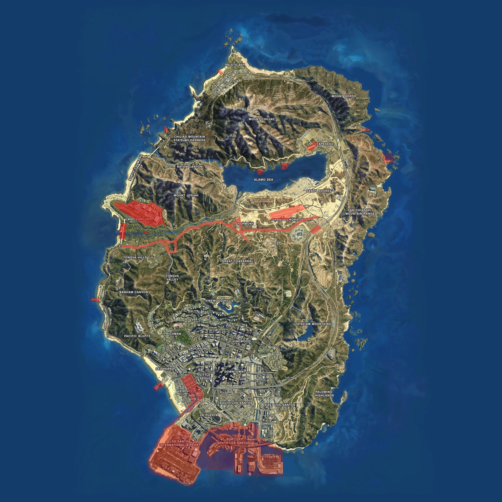

# Douanegebieden binnen Roermond

Roermond kent enkele douanegebieden. In een risicogebied mag preventief gefouilleerd worden. Dus dat wilt zeggen dat ook voertuigen gecontroleerd mogen worden. Hier onder zijn deze gebieden aangegeven.

De korpsleiding is bevoegd om, in samenspraak met de gemeenteraad van Roermond, aanvullende douanegebieden aan te wijzen. Hiervoor gelden dezelfde regels als de normale douanegebieden.

## Kaartweergave

Website is opgesteld door Mystic / medal.exe te Roermond
