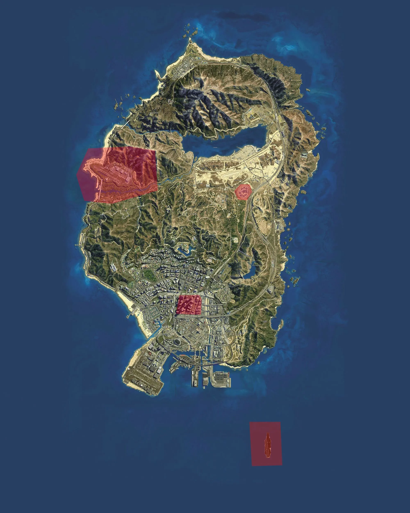

# NOTAM (Notice to Airmen)

De volgende gebieden zijn aangemerkt als no fly zones.

- Militaire basis
- Gevangenis
- Blokkenpark tot een hoogte van 300 meter (1000 feet)
- Vliegdekschip
- Ministerie van Defensie (Nabij postcode 6035)

Hier onder staan deze zones weergegeven op de kaart van Roermond.

Website is opgesteld door Mystic / medal.exe te Roermond
